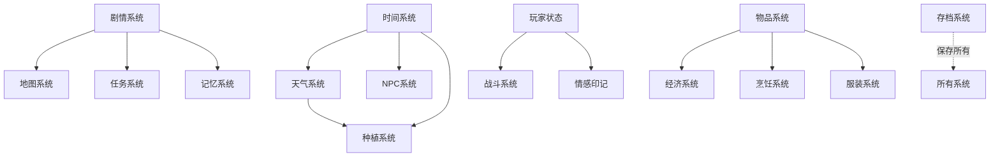

# 🎮 Reality游戏系统开发清单

> 最后更新：2024-12-28
> 状态说明：✅已完成 | 🚧开发中 | 📋计划中 | 💡概念阶段

## 📊 系统开发总览

```
总系统数：18个
已完成：2个 (11%)
开发中：3个 (17%)
计划中：13个 (72%)
```

---

## 🎯 核心系统清单（按优先级排序）

### 第一优先级：基础框架
| 系统名称 | 状态 | 文件位置 | 负责功能 | 依赖关系 |
|---------|------|---------|---------|---------|
| 1. **剧情系统** | 🚧 | `js/core/story-flags.js` | 主线支线管理、剧情标记、分支选择 | - |
| 2. **时间系统** | ✅ | `js/core/time-system.js` | 年月日时推进、时间流速控制 | - |
| 3. **存档系统** | ✅ | `js/core/save-system.js` | 游戏进度保存/读取 | 依赖所有系统 |
| 4. **玩家状态系统** | 🚧 | `js/core/world-state.js` | 体力心情精力、创伤值管理 | - |

### 第二优先级：世界构建
| 系统名称 | 状态 | 文件位置 | 负责功能 | 依赖关系 |
|---------|------|---------|---------|---------|
| 5. **地图系统** | 📋 | `js/core/map-system.js` | 三层世界、区域解锁、快速传送 | 剧情系统 |
| 6. **天气系统** | 🚧 | `js/core/weather-system.js` | 四季变化、日常气候、极端天气 | 时间系统 |
| 7. **NPC基础系统** | 📋 | `js/core/npc-system.js` | 普通NPC作息、简单对话 | 时间系统 |
| 8. **重要NPC系统** | 📋 | `js/ai/ai-npc-system.js` | Zero/观察者深度交互 | AI系统 |

### 第三优先级：游戏玩法
| 系统名称 | 状态 | 文件位置 | 负责功能 | 依赖关系 |
|---------|------|---------|---------|---------|
| 9. **战斗系统** | 📋 | `js/core/combat-system.js` | 回合制战斗、技能、狼魂机制 | 玩家状态 |
| 10. **探索系统** | 📋 | `js/core/exploration.js` | 线索收集、场景调查、隐藏发现 | 地图系统 |
| 11. **任务系统** | 📋 | `js/core/quest-system.js` | 主线/支线/日常任务管理 | 剧情系统 |
| 12. **物品系统** | 📋 | `js/core/inventory.js` | 背包管理、物品使用、装备 | - |

### 第四优先级：生活内容
| 系统名称 | 状态 | 文件位置 | 负责功能 | 依赖关系 |
|---------|------|---------|---------|---------|
| 13. **经济系统** | 📋 | `js/core/economy-system.js` | 货币、交易、市场价格 | 物品系统 |
| 14. **种植系统** | 📋 | `js/core/farming-system.js` | 作物种植、生长、收获 | 时间+天气 |
| 15. **烹饪系统** | 💡 | `js/core/cooking-system.js` | 食谱、烹饪、食物效果 | 物品系统 |
| 16. **手机系统** | 💡 | `js/core/phone-system.js` | 通讯、应用、信息查看 | - |

### 第五优先级：深度系统
| 系统名称 | 状态 | 文件位置 | 负责功能 | 依赖关系 |
|---------|------|---------|---------|---------|
| 17. **记忆系统** | 💡 | `js/core/memory-system.js` | 记忆碎片、回忆重现、认知失调 | 剧情系统 |
| 18. **情感印记** | 💡 | `js/core/emotion-system.js` | 情感网络、印记类型、觉醒路线 | NPC系统 |
| 19. **声望系统** | 💡 | `js/core/reputation.js` | 组织声望、地区声望、内容解锁 | NPC系统 |
| 20. **服装系统** | 💡 | `js/core/clothing-system.js` | 换装、服装属性、场合着装 | 物品系统 |

### 第六优先级：娱乐扩展
| 系统名称 | 状态 | 文件位置 | 负责功能 | 依赖关系 |
|---------|------|---------|---------|---------|
| 21. **小游戏系统** | 💡 | `js/minigames/` | 解谜、音游、反应测试 | - |
| 22. **AI随机系统** | 💡 | `js/ai/random-events.js` | 随机事件、动态对话、程序化内容 | AI系统 |

---

## 🔄 系统间交互关系图



---

## 📝 实现计划

### 第一阶段（当前）
- [x] 基础UI框架
- [x] 时间系统
- [x] 基础存档
- [ ] 剧情系统框架
- [ ] 玩家状态完善

### 第二阶段
- [ ] 地图系统
- [ ] 天气系统完善
- [ ] 基础NPC系统
- [ ] 简单任务系统

### 第三阶段
- [ ] 战斗系统
- [ ] 物品背包
- [ ] 经济系统
- [ ] 探索机制

### 第四阶段
- [ ] 生活系统集成
- [ ] 重要NPC AI对话
- [ ] 记忆系统

### 第五阶段
- [ ] 深度系统
- [ ] 小游戏
- [ ] 成就收集

---

## 💭 开发笔记

### 当前重点
1. 完善剧情系统，让故事能推进
2. 确保存档系统稳定
3. 实现基础地图导航

### 技术债务
- 需要重构world-state.js
- AI系统待接入API
- 性能优化（后期）

### 创意想法池
- 插图收集系统（已规划，暂缓）
- 成就系统（依赖收集系统）
- 多结局系统（依赖剧情完善）

---

## 🎯 下一步行动

1. **讨论确定**：哪个系统最优先？
2. **详细设计**：选中系统的具体实现
3. **原型开发**：快速实现基础版本
4. **测试迭代**：确保与现有系统兼容
5. **文档更新**：记录实现细节

---

*这是一个活文档，会随着开发进度持续更新*