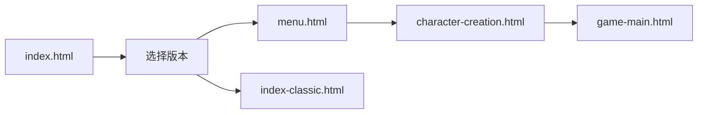

# Reality游戏 - 项目文件结构说明（最新版）
更新时间：2024年

## 🎮 快速导航
- **游戏入口**: `index.html` (选择版本页面)
- **主菜单**: `menu.html`
- **角色创建**: `character-creation.html`
- **游戏主界面**: `game-main.html`
- **经典版本**: `index-classic.html`

## 📁 核心目录结构

```
yozi/
│
├── 📄 HTML文件（根目录）
│   ├── index.html              # ⭐ 游戏入口 - 版本选择页面
│   ├── menu.html              # 主菜单界面
│   ├── character-creation.html # 角色创建界面
│   ├── game-main.html         # 游戏主界面
│   └── index-classic.html     # 经典版本入口
│
├── 📁 css/                    # 所有样式文件
│   ├── menu.css              # 主菜单样式
│   ├── character-creation.css # 角色创建样式
│   ├── game-main.css         # 游戏主界面样式
│   ├── styles.css            # 通用样式
│   └── game-styles.css       # 游戏内样式
│
├── 📁 js/                     # JavaScript目录
│   │
│   ├── 📁 core/              # 核心游戏系统
│   │   ├── game.js           # 游戏主逻辑
│   │   ├── game-data.js      # 游戏数据
│   │   └── advanced-game.js  # 高级游戏系统
│   │
│   ├── 📁 ai/                # AI系统
│   │   ├── ai-config.js      # AI基础配置
│   │   ├── ai-npc-system.js  # NPC AI系统
│   │   └── ai-conversation.js # AI对话系统
│   │
│   ├── 📁 api/               # API管理
│   │   ├── api-state.js      # API状态管理
│   │   ├── api-manager.js    # API管理器
│   │   └── api-settings-ui.js # API设置界面
│   │
│   ├── 📁 pages/             # 页面专用JS
│   │   ├── menu.js           # 主菜单逻辑
│   │   ├── character-creation.js # 角色创建逻辑
│   │   └── game-main.js      # 游戏主界面逻辑
│   │
│   └── 📁 utils/             # 工具函数
│       ├── animations.js     # 动画效果
│       ├── storage.js        # 存储管理
│       └── helpers.js        # 辅助函数
│
├── 📁 docs/                   # 文档目录
│   └── 开发文档/
│       ├── 游戏系统API文档.md
│       ├── AI配置指南.md
│       └── 项目文件结构-最新.md (本文件)
│
├── 📁 config/                 # 配置文件
│   └── game-config.json      # 游戏配置
│
├── 📁 backup/                 # 备份文件
│   └── (旧版本文件备份)
│
└── 📄 其他文件
    ├── manifest.json          # PWA配置
    ├── sw.js                 # Service Worker
    └── test-new.html         # 测试文件

```

## 🔄 游戏流程



## 📝 重要说明

### 1. HTML文件位置
- 所有主要HTML文件都在**根目录**，方便GitHub Pages访问
- 不要将HTML文件放在子目录中，会导致路径问题

### 2. 资源引用规则
- CSS文件：`href="css/文件名.css"`
- JS文件：`src="js/目录/文件名.js"`
- 例如：
  ```html
  <link rel="stylesheet" href="css/menu.css">
  <script src="js/pages/menu.js"></script>
  ```

### 3. API配置
- API密钥**不写入**前端代码
- 用户在界面中输入API密钥
- 使用localStorage保存配置

### 4. 文件命名规范
- HTML: 小写，用连字符分隔 (如 `character-creation.html`)
- CSS: 与对应HTML同名 (如 `character-creation.css`)
- JS: 驼峰命名或连字符 (如 `gameMain.js` 或 `game-main.js`)

## 🚀 快速开始

1. **本地测试**: 直接打开 `index.html`
2. **GitHub Pages**:
   - 推送到GitHub
   - 设置Pages指向主分支根目录
   - 访问 `https://用户名.github.io/仓库名/`

## 🔧 常见问题

### Q: CSS/JS加载不出来？
A: 检查HTML中的路径引用是否正确：
- CSS应该是 `css/xxx.css`
- JS应该是 `js/xxx/xxx.js`

### Q: 找不到文件？
A: 参考上面的目录结构，确认文件位置

### Q: API调用失败？
A: 检查是否在设置中配置了API密钥

## 📌 开发备忘

- ✅ 文件已重新组织到对应目录
- ✅ HTML文件保持在根目录
- ✅ 路径引用已全部修正
- ✅ 保留了所有动画效果
- ✅ API配置通过UI输入