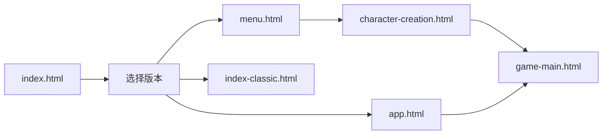

# Reality游戏 - 项目文件结构说明（最新版）
更新时间：2024年12月21日

## 🎮 快速导航
- **游戏入口**: `index.html` (选择版本页面)
- **主菜单**: `menu.html`
- **角色创建**: `character-creation.html`
- **游戏主界面**: `game-main.html` ⭐ 核心游戏界面
- **经典版本**: `index-classic.html`
- **App入口**: `app.html` (PWA专用)

## 📁 核心目录结构

```
yozi/
│
├── 📄 HTML文件（根目录）
│   ├── index.html              # ⭐ 游戏入口 - 版本选择页面
│   ├── app.html               # PWA应用入口
│   ├── menu.html              # 主菜单界面
│   ├── character-creation.html # 角色创建界面
│   ├── game-main.html         # 🎮 游戏主界面（核心）
│   ├── index-classic.html     # 经典版本入口
│   └── test-*.html            # 各种测试演示页面
│
├── 📁 css/                    # 所有样式文件
│   ├── app.css               # PWA应用样式
│   ├── menu.css              # 主菜单样式
│   ├── character-creation.css # 角色创建样式
│   ├── game-main.css         # 🎨 游戏主界面样式（核心）
│   └── styles-old.css        # 旧版样式（备份）
│
├── 📁 js/                     # JavaScript目录
│   │
│   ├── 📁 core/              # 🔧 核心游戏系统
│   │   ├── game-engine.js    # 游戏引擎（新）
│   │   ├── scene-manager.js  # 🎬 场景管理系统
│   │   ├── f2-manager.js     # 🎮 F2区域管理器
│   │   ├── illustration-manager.js # 🖼️ 插图管理系统
│   │   ├── database.js       # 🗄️ 数据库管理
│   │   ├── data-bridge.js    # 🌉 数据桥接
│   │   ├── app-router.js     # 🛣️ 应用路由
│   │   └── advanced-game.js  # 高级游戏系统
│   │
│   ├── 📁 ai/                # 🤖 AI系统
│   │   ├── ai-config.js      # AI基础配置
│   │   └── ai-npc-system.js  # NPC AI系统
│   │
│   ├── 📁 api/               # 🌐 API管理
│   │   ├── api-state.js      # API状态管理
│   │   ├── api-manager.js    # API管理器
│   │   ├── api-config.js     # API配置文件
│   │   ├── api-adapter.js    # API适配器
│   │   ├── api-config-ui.js  # API配置UI
│   │   ├── api-settings-ui.js # API设置界面
│   │   ├── api-settings-screen.js # API设置屏幕
│   │   └── api-preset-manager.js # API预设管理
│   │
│   ├── 📁 pages/             # 📄 页面专用JS
│   │   ├── menu.js           # 主菜单逻辑
│   │   ├── character-creation.js # 角色创建逻辑
│   │   ├── game-main.js      # 🎮 游戏主界面逻辑
│   │   └── api-settings.js   # API设置页面
│   │
│   ├── 📁 data/              # 📊 游戏数据
│   │   ├── scene-illustrations.js # 场景插图数据
│   │   ├── combat-system.js  # 战斗系统数据
│   │   └── scenes/           # 场景数据目录
│   │       └── opening.js    # 开场场景
│   │
│   └── 📁 utils/             # 🛠️ 工具函数
│       ├── animations.js     # 动画效果
│       ├── app-init.js       # 应用初始化
│       └── emergency-fix.js  # 紧急修复工具
│
├── 📁 docs/                   # 📚 文档目录
│   ├── 开发文档/
│   │   ├── 项目文件结构-最新.md (本文件)
│   │   ├── DEVELOPMENT_NOTES.md
│   │   ├── PROJECT_REQUIREMENTS.md
│   │   ├── GAME_DESIGN.md
│   │   └── 游戏设计计划/
│   └── 用户文档/
│       ├── README.md
│       ├── QUICK_START.md
│       └── AI配置说明.md
│
└── 📄 PWA配置文件
    ├── manifest.json          # PWA配置清单
    └── sw.js                 # Service Worker

```

## 🔄 游戏流程



## 🎮 game-main.html 界面分区详解

### 上半部分 (45vh) - 信息展示区
```
┌──────────────────────────────────────┐
│  A区(35%)  │      右侧区域(65%)        │
│            │ ┌──────────────────────┐  │
│   角色     │ │ B区 - 位置/时间栏    │  │
│   立绘     │ ├──────────────────────┤  │
│            │ │ C区 - 景色预览       │  │
│            │ ├──────────────────────┤  │
│            │ │ D区 - 功能面板       │  │
│            │ │ (7个标签页+内容区)   │  │
│            │ └──────────────────────┘  │
├──────────────────────────────────────┤
│         E区 - 提醒栏(滚动文本)        │
└──────────────────────────────────────┘
```

### 下半部分 (55vh) - 剧情互动区
```
┌──────────────────────────────────────┐
│         F1区 - 剧情文本区             │
│  - 故事文本显示                       │
│  - 选项按钮(单选/多选)               │
│  - 插图容器(illustrationContainer)   │
├──────────────────────────────────────┤
│    F2区 - 场景控制/AI输入(双模式)     │
│  场景模式: [▶️继续][↩️重置][🔍放大镜] │
│  AI模式: [输入框...........] [发送➤]  │
└──────────────────────────────────────┘
```

## 📝 重要说明

### 1. HTML文件位置
- 所有主要HTML文件都在**根目录**，方便GitHub Pages访问
- 不要将HTML文件放在子目录中，会导致路径问题
- 测试文件(test-*.html)用于功能演示和调试

### 2. 资源引用规则
- CSS文件：`href="css/文件名.css"`
- JS文件：`src="js/目录/文件名.js"`
- 例如：
  ```html
  <link rel="stylesheet" href="css/game-main.css">
  <script src="js/core/scene-manager.js"></script>
  <script src="js/core/f2-manager.js"></script>
  ```

### 3. 核心系统架构
- **Scene Manager**: 管理场景切换和内容
- **F2 Manager**: 管理F2区域的场景/AI模式切换
- **Illustration Manager**: 管理插图显示系统
- **Database**: IndexedDB数据持久化
- **API System**: 完整的API配置和管理

### 4. 文件命名规范
- HTML: 小写，用连字符分隔 (如 `character-creation.html`)
- CSS: 与对应HTML同名 (如 `character-creation.css`)
- JS: 驼峰命名或连字符 (如 `scene-manager.js`)

## 🚀 快速开始

1. **本地测试**: 直接打开 `index.html`
2. **GitHub Pages**:
   - 推送到GitHub
   - 设置Pages指向主分支根目录
   - 访问 `https://用户名.github.io/仓库名/`

## 🔧 常见问题

### Q: CSS/JS加载不出来？
A: 检查HTML中的路径引用是否正确：
- CSS应该是 `css/xxx.css`
- JS应该是 `js/xxx/xxx.js`

### Q: 找不到文件？
A: 参考上面的目录结构，确认文件位置

### Q: API调用失败？
A: 检查是否在设置中配置了API密钥

## 📌 开发备忘

- ✅ 文件已重新组织到对应目录
- ✅ HTML文件保持在根目录
- ✅ 路径引用已全部修正
- ✅ 保留了所有动画效果
- ✅ API配置通过UI输入